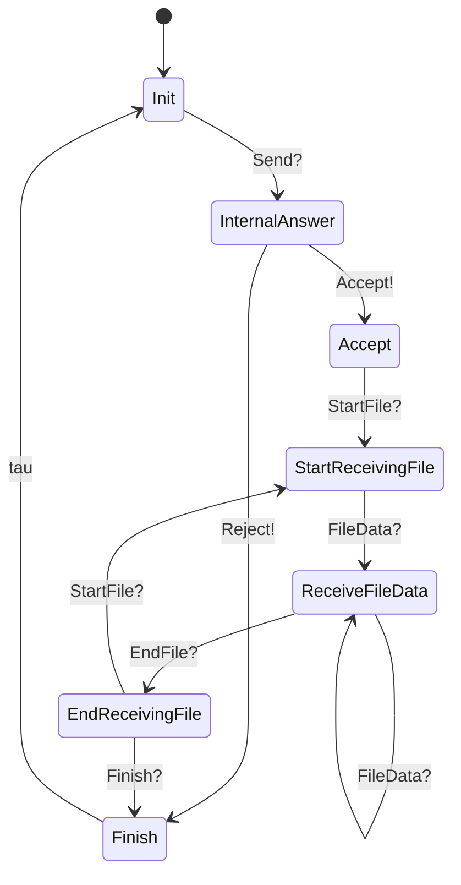
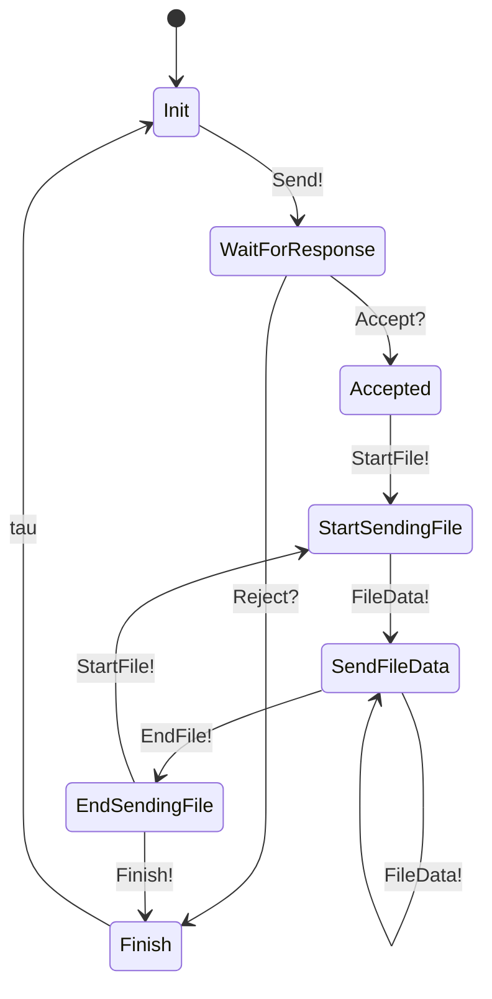

# medusa-li

## Overview
- Send files securely via TCP/TLS 1.3 in local network

## Process
- Each receiver runs a TCP server to listen for connections from sender
- Initiate state machines for server and client, communicate using a custom protocol
- Custom protocol for TCP packets:

```
    <package> := <package_type> <data>?
    <package_type> := Send | Accept | Reject | StartFile | EndFile | FileData | Finish
    <data> := FileInfo[] | Byte[]
```


## State machines

### Receiver (or server)



### Sender (or client)
