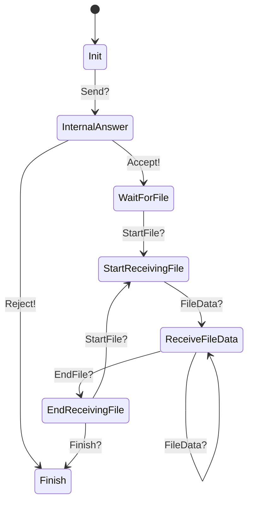
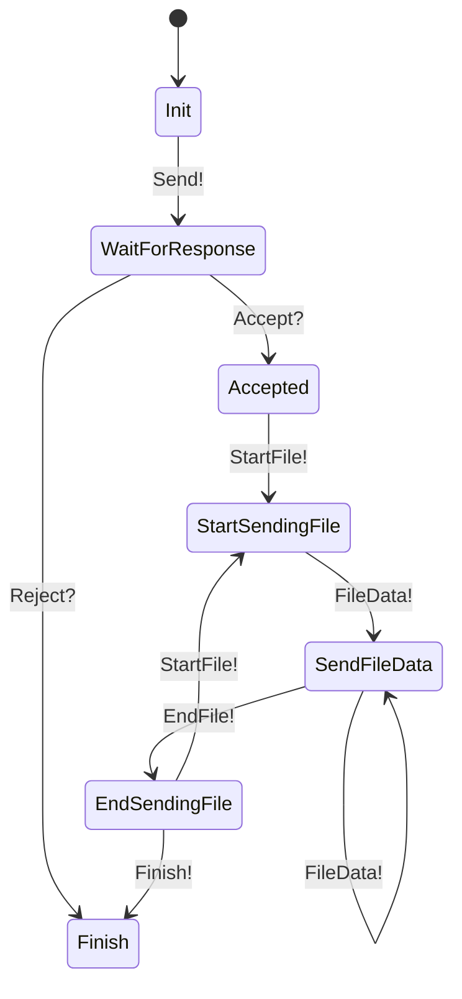

# sendfile-cli

## Overview
- Send files securely via TCP/TLS 1.3 in local network (no Internet needed)
- Automatically generate TLS private/public keys pair for each connection

## Process
- Each receiver runs a TCP server to listen for connections from sender
- Initiate state machines for server and client, communicate using a custom protocol
- Custom protocol for TCP packets:

```
    <package> := <package_type> <data-length> <data>?
    <package_type> := Send | Accept | Reject | StartFile | EndFile | FileData | Finish
    <data-length> := NUMBER
    <data> := FileInfo[] | Byte[]
```

- Length
    - <package_type>: 1 byte (number range from 0..2^8)
    - <data-length>: 2 bytes (number range from 0..2^16)
    - <data>: byte array (maximum 61 bytes)


## State machines (mermaid)

### Receiver (or server)



### Sender (or client)


## Run examples
- Run server
    ```
    RUST_LOG=debug cargo run -- -s 7878
    ```

- Run client
    ```
    RUST_LOG=debug cargo run -- -c 127.0.0.1:7878 -f test-data/file1.txt -f test-data/file2.txt
    ```